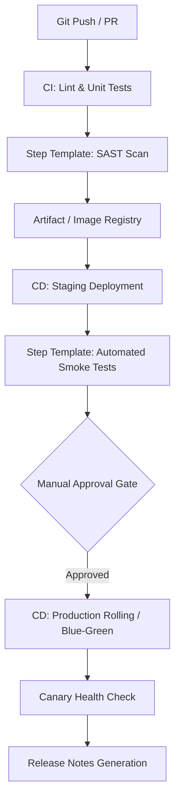

# azure-devops-release-governance-toolkit

## Architecture Overview


## Directory Structure

```text
.
├── .azuredevops
│   └── pull_request_template.md
├── pipelines
│   ├── templates
│   │   ├── steps
│   │   │   ├── sast-scan.yml
│   │   │   └── automated-smoke-test.yml
│   │   └── jobs
│   ├── ci-pipeline.yml
│   └── cd-release-pipeline.yml
├── scripts
│   └── bash
│       └── generate-release-notes.sh
└── terraform
    └── environments
```
Governance Controls
``` text
Component	Standard / Enforcement	Implementation
Static Security	Zero High/Critical CVEs	pipelines/templates/steps/sast-scan.yml
Quality Gate	HTTP 200 via Exponential Retry	pipelines/templates/steps/automated-smoke-test.yml
Approval Flow	Multi-party Environment Gates	pipelines/cd-release-pipeline.yml
Audit Trail	Immutable Commit Log Diff	scripts/bash/generate-release-notes.sh
```
Pipeline Configuration

1. Template Usage
```text
steps:
  - template: pipelines/templates/steps/automated-smoke-test.yml
    parameters:
      targetEndpoint: 'https://api.internal.domain/healthz'
      maxRetries: 5
      retryIntervalSeconds: 10
```
2. CI Pipeline
```text
trigger:
  branches:
    include:
      - main
      - release/*

stages:
  - stage: Lint_and_Scan
    jobs:
      - job: SecurityGovernance
        steps:
          - template: templates/steps/sast-scan.yml
            parameters:
              scanTarget: '$(Build.SourcesDirectory)'
              severityThreshold: 'HIGH,CRITICAL'
```
3. CD Pipeline
```text
stages:
  - stage: Staging_Deployment
    jobs:
      - deployment: DeployStaging
        environment: 'staging'
  - stage: Production_Deployment
    dependsOn: Staging_Deployment
    jobs:
      - deployment: DeployProduction
        environment: 'production'
```
Execution Commands

Health Check
```text
curl -s -o /dev/null -w "%{http_code}" https://api.domain.com/healthz
```
Release Notes Generation
```text
bash scripts/bash/generate-release-notes.sh HEAD
```
License

MIT


